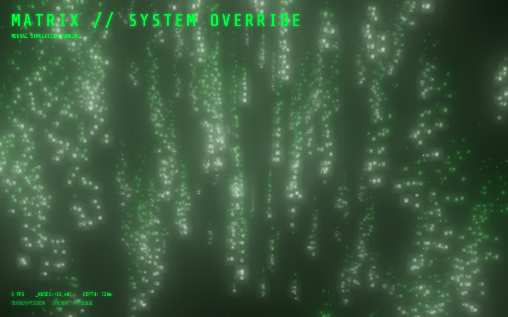

# Matrix // System Override

一个基于 **Three.js** 打造的仿《黑客帝国》数字雨 3D 视觉网站。

## 特性

- 多层 3D 数字雨粒子系统，使用 `InstancedMesh` 高性能渲染
- 发光尾迹 + 实时字符切换
- UnrealBloom 辉光后处理
- 动态相机与鼠标/滚轮交互
- 启动序列动画
- 响应式布局

## 在线预览

直接用浏览器打开 `index.html` 即可运行（依赖 CDN，需联网）。

## 交互

- **鼠标移动**：旋转视角
- **滚轮**：缩放景深
- **双击**：重置视角

## 技术栈

- Three.js 0.160
- Three.js Post-processing（Bloom）
- 原生 ES Modules + CDN

## License

MIT
